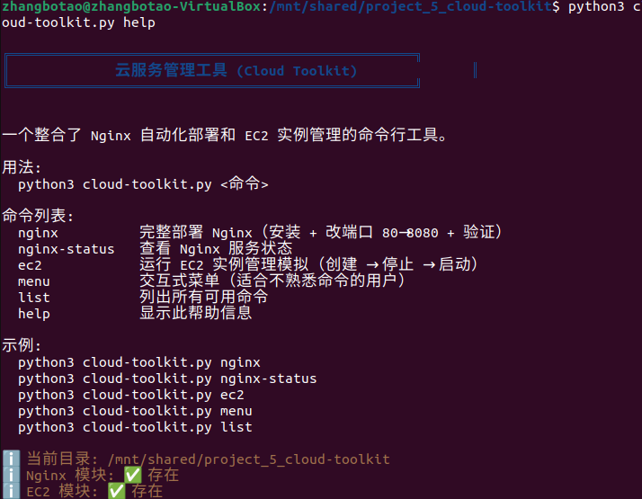
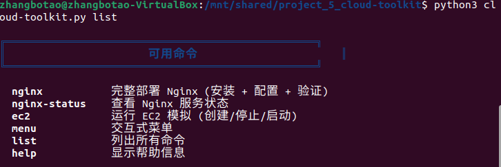
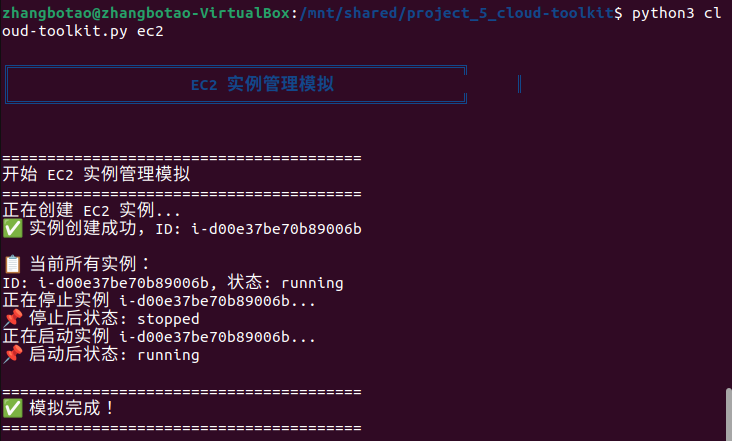

# Cloud Toolkit — 云服务管理工具

> 一个命令行工具，整合 Nginx 自动化部署和 EC2 实例管理。

## 项目简介

`cloud-toolkit` 是一个 Python 编写的命令行工具，将你之前四个项目整合成一个统一入口。通过一条命令即可完成 Nginx 部署、状态查看、EC2 模拟等操作。

## 技术栈

- Python 3
- subprocess
- sys.argv
- colorama（可选）
- Nginx / Ubuntu
- Boto3 + Moto

## 功能列表

| 命令 | 说明 |
|------|------|
| `nginx` | 完整部署 Nginx（安装 + 端口修改 80→8080 + 验证） |
| `nginx-status` | 查看 Nginx 服务状态 |
| `ec2` | 运行 EC2 实例管理模拟（创建 → 停止 → 启动） |
| `menu` | 交互式菜单模式 |
| `list` | 列出所有可用命令 |
| `help` | 显示完整帮助信息 |

## 项目结构

```
cloud-toolkit/
├── cloud-toolkit.py
├── nginx_manager.py
├── ec2_manager.py
├── README.md
├── screenshot_help.png
├── screenshot_list.png
├── screenshot_nginx_status.png
└── screenshot_ec2.png
```

## 运行方法

```bash
# 安装依赖（可选）
pip3 install colorama

# 查看帮助
python3 cloud-toolkit.py help

# 列出所有命令
python3 cloud-toolkit.py list

# 完整部署 Nginx
python3 cloud-toolkit.py nginx

# 查看 Nginx 状态
python3 cloud-toolkit.py nginx-status

# 运行 EC2 模拟
python3 cloud-toolkit.py ec2

# 交互式菜单
python3 cloud-toolkit.py menu
```

## 项目截图

### 帮助信息


### 命令列表


### Nginx 状态


### EC2 模拟


## 踩坑记录

- `modules/` 目录下必须有 `__init__.py`（空文件即可）
- `subprocess.run()` 调用外部脚本时，需确保脚本路径正确
- 彩色输出依赖 `colorama` 库，未安装时会自动降级

## 后续计划

- [ ] 加入 Docker 容器化支持
- [ ] 添加真实 AWS 环境切换
- [ ] 增加 Terraform 资源管理模块

## 相关项目

- [项目一：手动部署 Nginx](https://github.com/zhangbotao-2004/linux-web-deploy-practice)
- [项目二：Nginx 自动化部署](https://github.com/zhangbotao-2004/nginx-auto-deploy)
- [项目三：EC2 实例管理](https://github.com/zhangbotao-2004/ec2-manager)
- [项目四：综合管理工具](https://github.com/zhangbotao-2004/cloud-manager-tool)